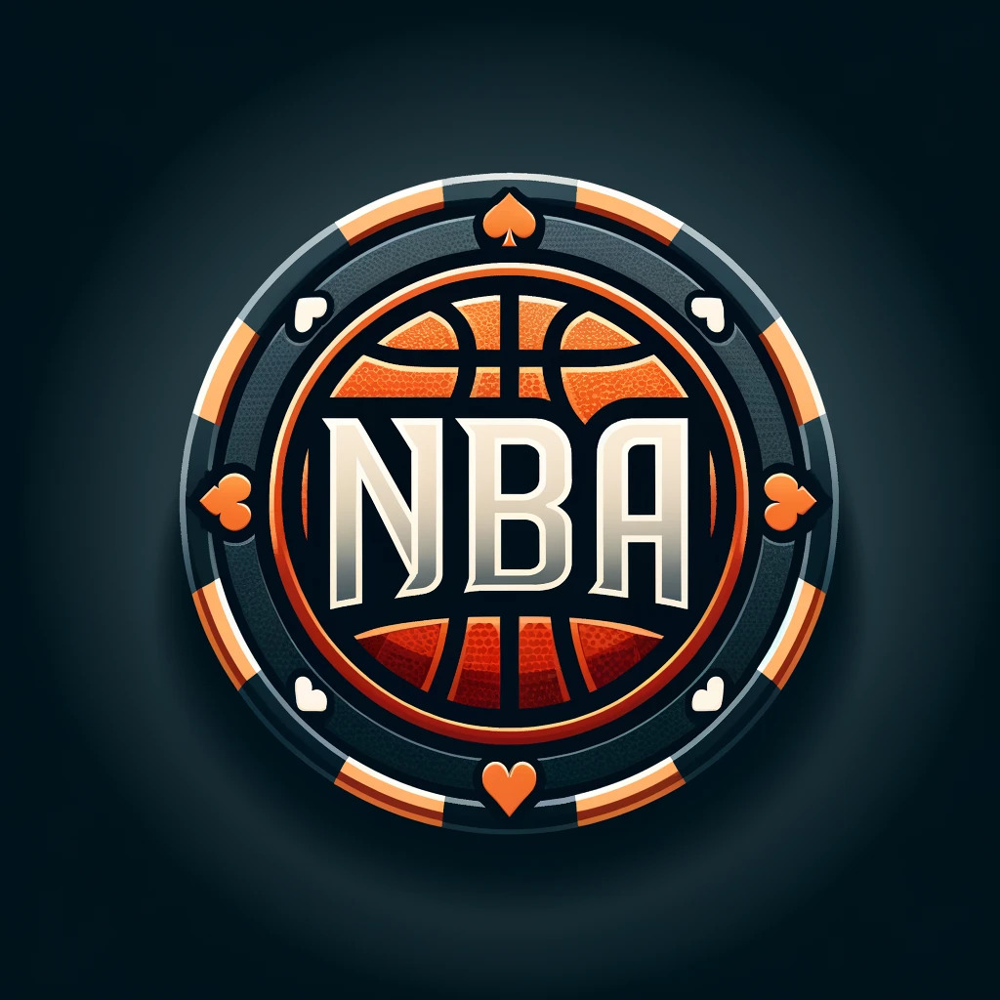

## Sobre NBAGame

NBAGame es un juego de cartas basado en la aleatoridad y la rejugabilidad el cual tiene un principio base de que cada partida sea diferente a la anterior, esta hecho para ser jugado offline actualmente pero se espera que para un futuro se puede desarrollar mas y poder ser jugado de forma multijugador

## Tecnologias usadas en NBAGame

NBAGame se basa principalmente en Laravel como motor de la aplicacion, obviamente usando php ya que laravel es un framework de php.

Tambien se usan las basicas para un desarrollo web como pueden ser HTML, CSS, JAVASCRIPt, BOOTSTRAP y MYSQL.

## Manual de instalacion

Una vez instaladas todas las dependencias que necesitamos para nuestro proyecto tenemos que descargar la carpeta de la aplicación, esto se puede hacer desde el github del proyecto (https://github.com/Phanteon314/NBAGame). Crearemos pues una carpeta dentro de nuestro directorio htdocs dentro de la carpeta xampp de nuestro ordenador, en esa carpeta descomprimiremos la carpeta de la aplicación.

Antes de tocar nada instalaremos ciertas extensiones que nos dan ciertas ayudas para formatear el codigo y funcionalidades varias. Estas extensiones son las siguientes:
•	Laravel Blade formatter
•	Laravel Blade Snippets
•	Laravel Snippets
•	Laravel goto view
•	PHP Intelephense

Para instalar una extensión sencillamente nos vamos al apartado de extensiones en nuestro VSCode y buscamos por el nombre especificado anteriormente los nombres de las extensiones donde le daremos a instalar y se nos descargan en nuestro editor.
 
Antes de empezar a usar el VSCode iniciaremos en nuestro panel XAMPP tanto el apache como el MySql.
 
Con ambos iniciados le daremos al boton admin de MySql para abrir el phpMyAdmin desde el cual dirigiremos nuestra base de datos, para esto lo que haremos dentro será crear nuestra base de datos nbagame, para esto sencillamente creamos una base de datos vacía con el nombre de nbagame:
 

Una vez el proyecto este ya disponible abrimos desde visual estudio la carpeta htdocs para ver nuestro proyecto, dentro de la carpeta nbagame nos iremos al archivo .env del proyecto. Dentro del mismo buscaremos las líneas donde especificamos la conexión con la base de datos, aquí pondremos nuestras conexiones específicas, este apartado depende de cada ordenador en lo que se refiere a los puertos que vamos a usar para conectarnos con nuestra base de datos. También se introducen aquí los usuarios que van a usar la base de datos, podemos poner root en un comienzo para poder acceder a la base de datos y posteriormente se podría cambiar a nuevos usuarios con privilegios diferentes creados:
 
Para crear un usuario dentro de la base de datos luego en la terminal podemos usar el comando para poder establecer que se tenga que iniciar con contraseña, de forma mas ordenada y segura de establecer una conexión con la base de datos. Estos pasos no son obligatorios pero son recomendables.

Finalmente abrimos una terminal en la carpeta principal (nbagame) para ejecutar los siguientes comandos:

Tendremos que ejecutar las migraciones de nuestra pagina, que basicamente insertaran en nuestra base de datos las tablas necesarias para la correcta creacion de nuestra base de datos:
 
Ya para acabar introduciremos nuestros seeders que nos especifican unos datos de entrada para que la pagina pueda tener ya entradas en la base de datos desde el comienzo:
 
	Cabe recalcar que en estos datos que introducimos tambien introducimos un usuario piloto que es el usuario administrador de la pagina el cual puede desde el comienzo hacer login con el uso de las credenciales admin para nombre de usuario y admin como contraseña. Admin-Admin para hacer login.
Una vez hecho todo esto nos podremos ir a la direccion http://localhost:8012(puerto Apache que estemos usando)/laravel/NBAGame/public/ y ya veremos nuestra aplicación en el navegador

## Como jugar

El juego opera con un conjunto de reglas que vienen establecidas por el creador de la aplicacion, dejo pues aqui explicado más concretamente cómo funciona el juego 

# Manejo de cartas

El juego usa un sistema de manejo de cartas para poder jugar al mismo, estas cartas pueden ser obtenidas por un usuario usando sus fondos para conseguirlas, ya puede ser comprandolas directamente por un precio mayor o jugarsela a obtenerlas por tiradas.
Las cartas de un usuario se pueden ver en el inventario y su manejo se realiza en el perfil para crear mazos. Estos mazos consisten en cuatro cartas del usuario que se juntan para crear un mazo, el cual usaremos posteriormente para jugar. Cabe destacar que estas cartas una vez se crean en un mazo ya no podran ser usadas en otros mazos y cada mazo tiene un numero de usos limitado para su uso en juego
A su vez cada carta esta constituida por unas estadisticas: tiro, defense, rebote, asistencia, atletismo. Tambien tienen como es obvio al tratarse de un juego de baloncesto el nombre del jugador, el equipo y la posicion en el mismo.

# Modo enfrentamiento

El modo principal de la aplicacion es el modo enfrentamiento, en el cual cada usuario con sus ya creados mazos decidira cual usar para jugar contra la maquina en un modo de juego que mezcla una Buena construccion de mazos con un gran factor de aleatoriedad que hace que nunca sepas como va a terminar la session. Se require como minimo un mazo para poder jugar una partida
En este modo un jugador selecciona un mazo el cual tiene un orden establecido previamente. Una vez seleccionado el mazo se genera un mazo con jugadores generados aleatoriamente el cual sera el mazo de la maquina, este mazo sera igual al mazo del jugador. Una vez creados los mazos empezara la partida, en la cual se enfrentaran las cartas en orden una a una sumando todas las estadisticas de la misma, la carta que tenga mayores estadisticas sera la ganadora del duelo aportando un punto al bando ganador. 
Una vez se realizan los duelos se suman las estadisticas individuales de las cuatro cartas una a una para sacar un sumatorio de la estadistica. De esta forma cada jugador tendra un resultado de tiro, defensa…, despues estas se compararan con el equivalente del otro jugador, dando un punto por resultado ganador.
Una vez finalizado el juego se suman todos los puntos y el jugador con mas puntos sera el ganador. En caso de ganar, el usuario obtiene 200 de saldo para su cuenta y el mazo que ha usado pierde un uso del mismo.

# Objetivo

El objetivo del juego es conseguir el mayor número de victorias posibles hasta que el usuario se quede sin saldo. Cada jugador comienza una sesion con un determinado saldo de 1500, el cual según se juegue ira disminuyendo segun el usuario vaya usando sus cartas. Al quedarse sin cartas, mazos y saldo, el usuario se declarara en bancarrota y se acabara la sesion, la cual guardara el numero de partidas ganadas (asi como mas estadísticas) y se añadira la partida a una leaderboard, una table que recogera que usuarios han conseguido más victorias en una misma sesion.

## Quienes somos

El desarrollador principal de la aplicacion es un experimentado desarrollador de aplicaciones web, el cual lleva en desarrollo de la pagina no mucho tiempo, ya que estamos hablando de una version 1.0 la cual no ha tenido mucho tiempo de desarrollo, pero se espera que en el futuro se puedan implementar mejoras que aumenten la calidad del producto.

Esperemos que os guste

## Sobre Laravel

Laravel es un framework de aplicaciones web con una sintaxis expresiva y elegante. Creemos que el desarrollo debe ser una experiencia placentera y creativa para ser verdaderamente gratificante. Laravel elimina las dificultades del desarrollo al facilitar tareas comunes utilizadas en muchos proyectos web, tales como:

Laravel es accesible, poderoso y proporciona las herramientas necesarias para aplicaciones grandes y robustas.

## Aprendiendo Laravel

Laravel tiene la documentación y la biblioteca de tutoriales en video más extensas y completas de todos los frameworks de aplicaciones web modernos, lo que facilita comenzar con el framework.

También puedes probar el Laravel Bootcamp, donde serás guiado a través de la construcción de una aplicación moderna de Laravel desde cero.

Si no te gusta leer, Laracasts puede ayudarte. Laracasts contiene miles de tutoriales en video sobre una variedad de temas, incluyendo Laravel, PHP moderno, pruebas unitarias y JavaScript. Mejora tus habilidades explorando nuestra completa biblioteca de videos.

